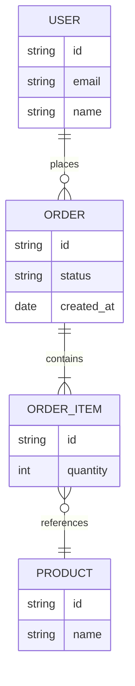

## Language

Follow language settings in `claude.md`. Default to English if not specified.

## Objective

Generate `./01_Requirements_Document/05_data_model.md` from Use Case files and Business Rules.

This is a **logical data model** — entities, attributes, and relationships only. No table names, column types, indexes, or implementation detail. This file is consumed by LLM to generate screen list, test cases, and physical schema.

---

## Execution Steps

### Step 1 — Pre-Flight Check

Read the following files. If UC files or BR are missing → STOP and report:

```
ERROR: [filename] not found. Run the corresponding generator first.
```

- `./.spec/docs/convention.md` — ID convention for all symbols
- `./01_Requirements_Document/03_usecases/plan.md` — to identify which UC files exist
- `./01_Requirements_Document/03_usecases/M[MM]_[slug].md` — all files marked `[x]` in plan
- `./01_Requirements_Document/04_business_rules.md` — for constraints on entities
- `./01_Requirements_Document/project-overview.md` — for system-level context only

---

### Step 2 — Entity Extraction

Scan all UC files and extract entities — things the system stores, retrieves, or operates on.

**Signals for an entity:**

- Nouns that appear as objects of system actions: "System saves **order**", "System displays **user profile**"
- Nouns referenced across multiple UC flows
- Nouns in Preconditions or Postconditions: "**Session** must be active"

**Not entities:**

- Screens, pages, UI states
- Actions or events (these are behaviors, not data)
- Duplicates — merge same concept under one name

For each entity, extract:

- Name (singular noun, PascalCase)
- Attributes implied by UC flows (names only, no types)
- Source UCs: `UC[MM].[NN].[PP]`

---

### Step 3 — Relationship Extraction

Scan UC flows for interactions between entities:

- "System links **order** to **user**" → Order belongs to User
- "System adds **item** to **cart**" → Cart has many Items
- "**Invoice** is generated from **order**" → Invoice derived from Order

Classify each relationship:

- `1:1` — one entity instance relates to exactly one of another
- `1:N` — one entity relates to many of another
- `N:M` — many-to-many (note: will require join entity in physical schema)

---

### Step 4 — Constraint Mapping

For each entity and attribute, check `04_business_rules.md`:

- `VAL` rules → attribute-level constraints (e.g., "Email must be unique")
- `PRM` rules → access constraint on entity (e.g., "Only Admin can access User entity")
- `BIZ` rules → entity-level business constraint (e.g., "Order total must be > 0")

Link each constraint by `BR[RR]` — do not copy the rule text, only reference the ID.

---

### Step 5 — ID Assignment

Assign `E[EE]` sequentially after deduplication, ordered by first appearance across UC files.

---

### Step 6 — Output Generation

Write to: `./01_Requirements_Document/05_data_model.md`

---

## Output Format

````markdown
# Logical Data Model

<!-- source: 03_usecases/*.md, 04_business_rules.md -->
<!-- total: [N] entities -->

---

## ERD



---

## Entities

### E[EE] — [Entity Name]

**Source:** UC[MM].[NN].[PP], UC[MM].[NN].[PP]

**Attributes**

| Attribute   | Description          | Constraints    |
| ----------- | -------------------- | -------------- |
| id          | Unique identifier    | —              |
| [attribute] | [what it represents] | BR[RR], BR[RR] |
| [attribute] | [what it represents] | —              |

**Relationships**

| Related Entity | Type | Description         |
| -------------- | ---- | ------------------- |
| E[EE] — [Name] | 1:N  | [brief description] |
| E[EE] — [Name] | N:M  | [brief description] |

---

### E[EE] — [Entity Name]

(repeat structure)
````

---

## Output Format Rules

**ERD:** Use Mermaid `erDiagram` syntax. Entity names in ERD must match `E[EE] — [Entity Name]` entries exactly. Relationship labels are short verbs. Cardinality uses standard Mermaid notation (`||`, `o{`, `|{`, etc.).

**Entity Name:** Singular, PascalCase. Same name used in ERD and entity section.

**Attributes:** Names only — no data types, no default values. Description is one phrase. Constraints column references `BR[RR]` only — do not copy rule text inline.

**Relationships:** List from the perspective of the current entity. Both sides of a relationship must be listed in their respective entity sections.

**Source:** List all UC IDs where this entity first appears or is significantly operated on.

---

## Constraints

DO NOT include in data model:

| What                               | Belongs in                     |
| ---------------------------------- | ------------------------------ |
| Table names, column types, indexes | Physical Schema (Design Phase) |
| API request/response shape         | Design Phase                   |
| UI field labels                    | Screen List                    |
| Validation logic detail            | Business Rules                 |
| Test scenarios                     | Test Cases                     |

---

## Behavioral Rules

- Generate immediately — no clarification questions
- Extract entities from UC observable behavior only — do not infer from project-overview.md
- Use `project-overview.md` for system context only (e.g., confirming entity scope)
- Deduplicate entities before assigning IDs
- Constraint column references BR IDs only — never copy rule text into this document
- N:M relationships noted but not resolved (resolution belongs to physical schema)
