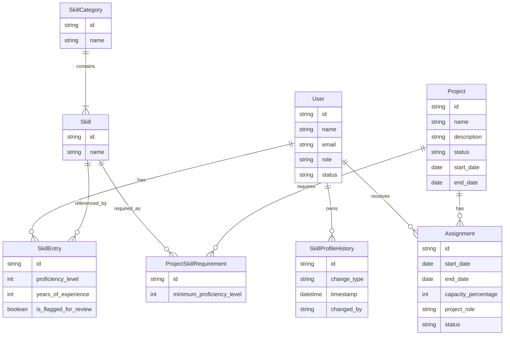

# Logical Data Model

<!-- source: usecases/*.md, business_rules.md -->
<!-- total: 8 entities -->

---

## ERD

---

## Entities

### E01 — User

**Source:** UC01.01.01, UC01.01.02, UC01.02.01

**Attributes**

| Attribute | Description                                   | Constraints      |
| --------- | --------------------------------------------- | ---------------- |
| id        | Unique identifier                             | —                |
| name      | Full name of the user                         | BR02             |
| email     | Email address used for account identification | BR01, BR02, BR03 |
| role      | Access role assigned to the user              | BR02, BR33       |
| status    | Active or inactive state of the account       | BR04             |

**Relationships**

| Related Entity            | Type | Description                                           |
| ------------------------- | ---- | ----------------------------------------------------- |
| E04 — SkillEntry          | 1:N  | A user owns many skill entries on their profile       |
| E05 — SkillProfileHistory | 1:N  | A user's profile generates a history entry per change |
| E08 — Assignment          | 1:N  | A user may hold many project assignments              |

---

### E02 — SkillCategory

**Source:** UC02.01.01

**Attributes**

| Attribute | Description                        | Constraints |
| --------- | ---------------------------------- | ----------- |
| id        | Unique identifier                  | —           |
| name      | Display name of the skill category | BR06        |

**Relationships**

| Related Entity | Type | Description                                  |
| -------------- | ---- | -------------------------------------------- |
| E03 — Skill    | 1:N  | A category contains one or more named skills |

---

### E03 — Skill

**Source:** UC02.01.01, UC02.02.01, UC02.02.02

**Attributes**

| Attribute | Description                                   | Constraints |
| --------- | --------------------------------------------- | ----------- |
| id        | Unique identifier                             | —           |
| name      | Display name of the skill within its category | BR05, BR08  |

**Relationships**

| Related Entity                | Type | Description                                          |
| ----------------------------- | ---- | ---------------------------------------------------- |
| E02 — SkillCategory           | N:1  | A skill belongs to exactly one category              |
| E04 — SkillEntry              | 1:N  | A skill is referenced in many employee skill entries |
| E07 — ProjectSkillRequirement | 1:N  | A skill may be required across many projects         |

---

### E04 — SkillEntry

**Source:** UC02.02.01, UC02.02.02, UC04.01.01

**Attributes**

| Attribute             | Description                                               | Constraints |
| --------------------- | --------------------------------------------------------- | ----------- |
| id                    | Unique identifier                                         | —           |
| proficiency_level     | Numeric proficiency rating for this skill                 | BR07, BR30  |
| years_of_experience   | Optional self-reported years of experience                | —           |
| is_flagged_for_review | Indicates the entry requires review after taxonomy change | BR24        |

**Relationships**

| Related Entity | Type | Description                                          |
| -------------- | ---- | ---------------------------------------------------- |
| E01 — User     | N:1  | A skill entry belongs to one employee's profile      |
| E03 — Skill    | N:1  | A skill entry references one skill from the taxonomy |

---

### E05 — SkillProfileHistory

**Source:** UC02.02.01, UC02.02.02

**Attributes**

| Attribute   | Description                                           | Constraints |
| ----------- | ----------------------------------------------------- | ----------- |
| id          | Unique identifier                                     | —           |
| change_type | Type of modification performed (add, edit, or remove) | —           |
| timestamp   | Date and time when the change was made                | BR25        |
| changed_by  | Identity of the actor who performed the change        | BR25        |

**Relationships**

| Related Entity | Type | Description                                                       |
| -------------- | ---- | ----------------------------------------------------------------- |
| E01 — User     | N:1  | A history entry belongs to one employee's profile (profile owner) |

---

### E06 — Project

**Source:** UC03.01.01, UC03.01.02, UC04.02.01, UC05.03.01

**Attributes**

| Attribute   | Description                                   | Constraints |
| ----------- | --------------------------------------------- | ----------- |
| id          | Unique identifier                             | —           |
| name        | Display name of the project                   | BR09        |
| description | Optional narrative description of the project | —           |
| status      | Current lifecycle status of the project       | BR09        |
| start_date  | Planned or actual project start date          | BR09        |
| end_date    | Optional planned or actual project end date   | —           |

**Relationships**

| Related Entity                | Type | Description                                    |
| ----------------------------- | ---- | ---------------------------------------------- |
| E07 — ProjectSkillRequirement | 1:N  | A project has many skill requirement entries   |
| E08 — Assignment              | 1:N  | A project has many employee assignment records |

---

### E07 — ProjectSkillRequirement

**Source:** UC03.02.01, UC03.02.02, UC03.02.03, UC05.03.01

**Attributes**

| Attribute                 | Description                                                      | Constraints |
| ------------------------- | ---------------------------------------------------------------- | ----------- |
| id                        | Unique identifier                                                | —           |
| minimum_proficiency_level | Minimum proficiency level required for this skill on the project | BR07, BR11  |

**Relationships**

| Related Entity | Type | Description                                                |
| -------------- | ---- | ---------------------------------------------------------- |
| E06 — Project  | N:1  | A skill requirement entry belongs to one project           |
| E03 — Skill    | N:1  | A skill requirement references one skill from the taxonomy |

---

### E08 — Assignment

**Source:** UC04.02.01, UC04.02.02, UC05.01.01, UC05.04.01

**Attributes**

| Attribute           | Description                                                    | Constraints |
| ------------------- | -------------------------------------------------------------- | ----------- |
| id                  | Unique identifier                                              | —           |
| start_date          | Date when the assignment begins                                | BR12, BR13  |
| end_date            | Optional date when the assignment ends                         | BR13        |
| capacity_percentage | Percentage of the employee's working capacity allocated        | BR12, BR26  |
| project_role        | Role the employee holds within the project for this assignment | BR12        |
| status              | Active or closed state of the assignment record                | —           |

**Relationships**

| Related Entity | Type | Description                           |
| -------------- | ---- | ------------------------------------- |
| E01 — User     | N:1  | An assignment belongs to one employee |
| E06 — Project  | N:1  | An assignment belongs to one project  |
