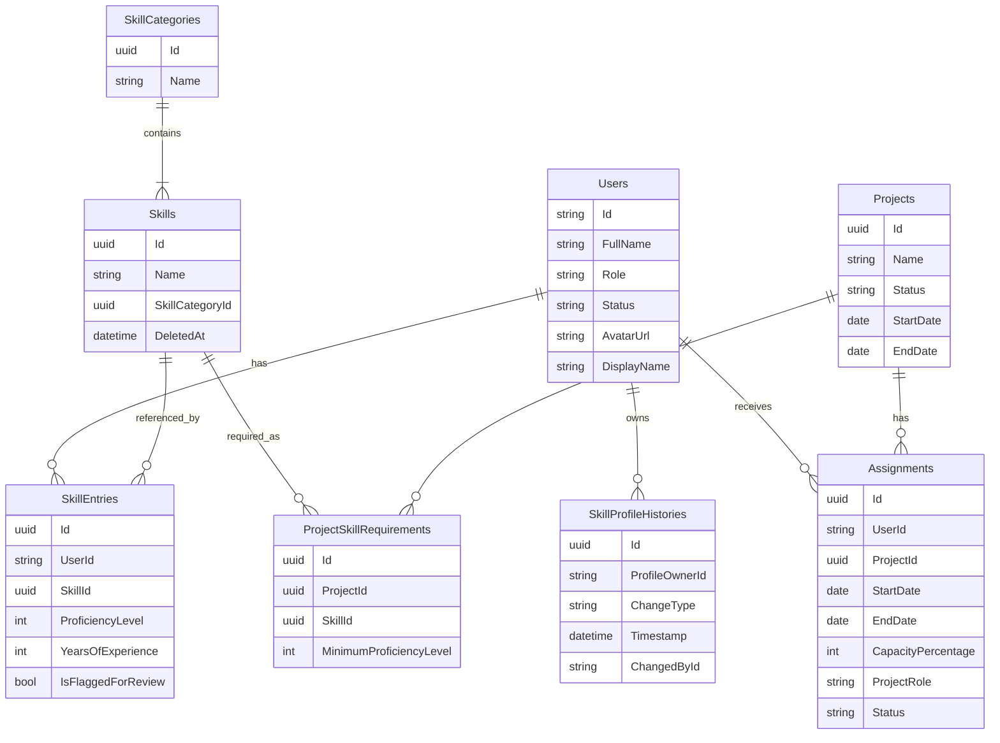

# Entity Relationships

<!-- source: data_model.md -->

```mermaid
erDiagram
  Users ||--o{ SkillEntries : "has"
  Users ||--o{ SkillProfileHistories : "owns"
  Users ||--o{ Assignments : "receives"
  SkillCategories ||--|{ Skills : "contains"
  Skills ||--o{ SkillEntries : "referenced_by"
  Skills ||--o{ ProjectSkillRequirements : "required_as"
  Projects ||--o{ ProjectSkillRequirements : "requires"
  Projects ||--o{ Assignments : "has"

  Users {
    string Id
    string FullName
    string Role
    string Status
    string AvatarUrl
    string DisplayName
  }

  SkillCategories {
    uuid Id
    string Name
  }

  Skills {
    uuid Id
    string Name
    uuid SkillCategoryId
    datetime DeletedAt
  }

  SkillEntries {
    uuid Id
    string UserId
    uuid SkillId
    int ProficiencyLevel
    int YearsOfExperience
    bool IsFlaggedForReview
  }

  SkillProfileHistories {
    uuid Id
    string ProfileOwnerId
    string ChangeType
    datetime Timestamp
    string ChangedById
  }

  Projects {
    uuid Id
    string Name
    string Status
    date StartDate
    date EndDate
  }

  ProjectSkillRequirements {
    uuid Id
    uuid ProjectId
    uuid SkillId
    int MinimumProficiencyLevel
  }

  Assignments {
    uuid Id
    string UserId
    uuid ProjectId
    date StartDate
    date EndDate
    int CapacityPercentage
    string ProjectRole
    string Status
  }
```
