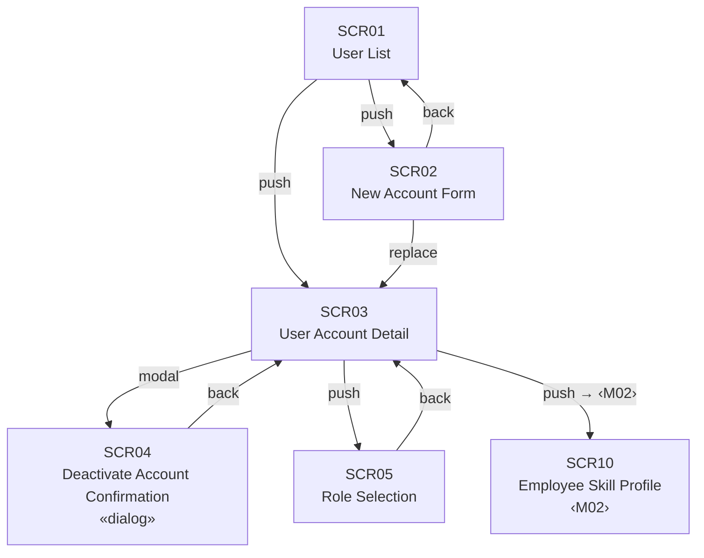
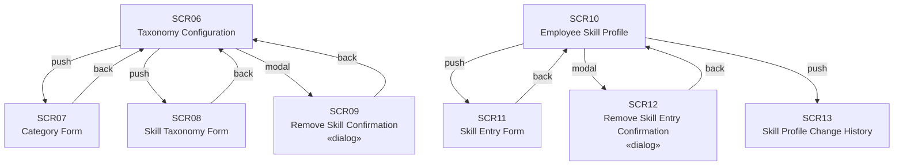
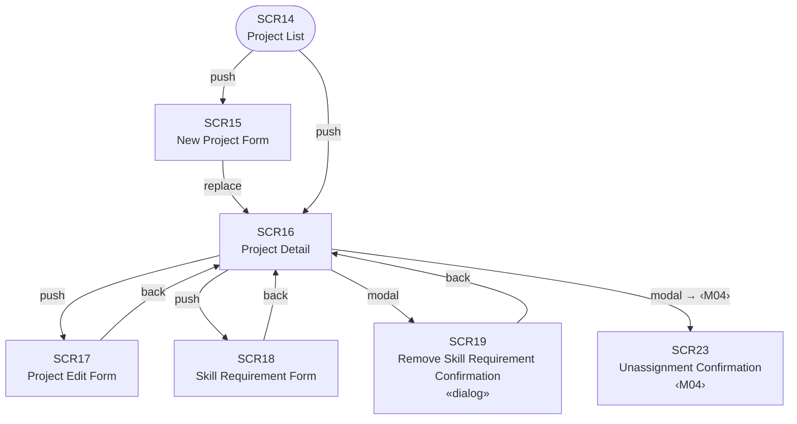
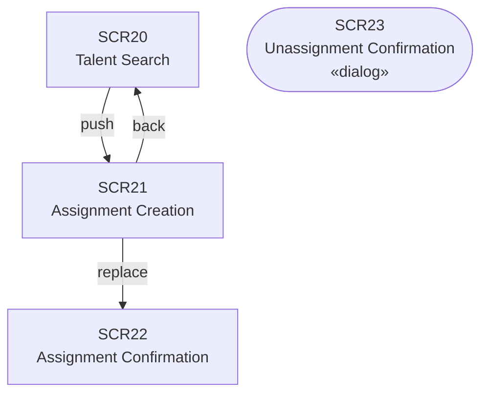
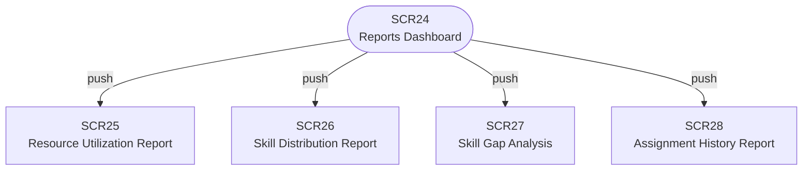

# Screen Transition

<!-- source: 06_screens/plan.md -->

---

## M01 — User Management

---

## M02 — Skill Administration

---

## M03 — Project Registry

---

## M04 — Staffing

---

## M05 — Reporting

